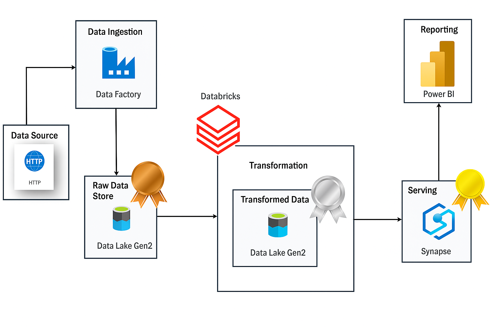

# AdventureWorks Sales Insights Platform – End-to-End Azure Data Engineering Project

This repository presents a complete, production-style Azure Data Engineering pipeline designed to simulate business analytics use cases for the AdventureWorks company. Built using Microsoft Azure’s modern data stack, this project delivers an integrated ETL solution from API-based ingestion to Power BI reporting, adhering to Medallion architecture (Bronze, Silver, Gold). A dedicated [GitHub Project Tracker](https://github.com/users/PratikshaGund10/projects/2) is included to demonstrate real-world agile practices.

---

## Business Statement

> **"The Sales Operations and Strategy team at AdventureWorks needs a unified view of regional sales performance, product demand trends, and return rates across categories over the past three years (2015–2017) to make informed decisions on inventory planning and regional promotions."**

This project addresses that requirement by designing a scalable data platform that cleans, models, and visualizes multi-year sales data for strategic insight.

---

## Learning Objectives

- Apply end-to-end data engineering principles using Azure-native tools
- Design, orchestrate, and transform big data pipelines with business relevance
- Deliver executive dashboards that support operational decision-making

---

## Tech Stack

| Component      | Tool/Service                    |
|----------------|----------------------------------|
| Data Ingestion | Azure Data Factory              |
| Storage        | Azure Data Lake Storage Gen2    |
| Transformation | Azure Databricks (PySpark)      |
| Serving Layer  | Azure Synapse Analytics (SQL)   |
| Reporting      | Power BI                        |
| Versioning     | Git & GitHub                    |

---

## Architecture Diagram

- **Bronze Layer** → Raw ingestion from HTTP API via ADF  
- **Silver Layer** → Cleaned, enriched data using PySpark in Databricks  
- **Gold Layer** → SQL-modeled views for Power BI reporting in Synapse

---

## Project Phases

### 🔹 Phase 1 – Ingestion (ADF → Bronze Layer)
- Built using Azure Data Factory with dynamic pipelines and parameterized datasets
- Pipeline looped through JSON-driven configs to load multiple GitHub CSV files via HTTP
- Stored raw data in ADLS Gen2 under `/bronze`

➡ [ADF Pipelines & Configs](./DataFactory/Dynamic_support_live)

**Subfolders:**
- `pipeline/`: Pipeline definitions  
- `dataset/`: Source/destination dataset configs  
- `linkedService/`: HTTP and ADLS connections  
- `Parameters/`: JSON parameter file for dynamic ingestion

---

### Phase 2 – Transformation (Databricks → Silver Layer)
- Used Azure Databricks to transform Bronze data into clean Parquet format
- Applied string parsing, joins, date enrichment, and schema alignment

➡ [Silver Layer Databricks Notebook](./Databricks/Notebooks/Sliver%20Layer.html)

*Note: Notebook exported as HTML for readability and sharing.*

---

### Phase 3 – Serving (Synapse → Gold Layer)
- Queried Parquet files from `/silver` using Serverless SQL in Synapse
- Created modular views to serve as fact and dimension tables

➡ [Synapse SQL Scripts](./Synapse)

**Key Scripts:**
- `Create External Table.sql`: Define external tables on Parquet files  
- `Create_Schema.sql`: Optional schema object definitions  
- `view *.sql`: Sales, returns, territories, product hierarchy, customers, and calendar views

---

### Phase 4 – Visualization (Power BI)
- Connected Power BI to Synapse views using DirectQuery
- Designed dashboards for:
  - Sales trends over time
  - Return patterns by product category
  - Performance by region and subcategory

➡ *Power BI artifacts not yet uploaded – recommend adding `.pbix` file or screenshot in `PowerBI/` folder*

---

## Folder Structure

-  [DataFactory](./DataFactory/Dynamic_support_live)
-  [Databricks](](./Databricks/)
-  [Synapse](./Synapse)
-  [DataLake](./DataLake)
-  [Architecture.png](./Architecture.png)
-  [README.md](./README.md)

---

## Project Tracker

Track development tasks, enhancements, and workflow on the [GitHub Project Board](https://github.com/users/PratikshaGund10/projects/2).

---

## Highlights

-  ADF parameterized ingestion with ForEach loop  
-  PySpark-based transformation and enrichment  
-  Structured Data Lake using Medallion zones  
-  Star schema design and Synapse views  
-  Power BI dashboards tied to business KPIs  
-  Clean, modular repo structure and code documentation

---

## About Me

I'm a data engineering and analytics enthusiast passionate about building real-world cloud data solutions. This project demonstrates my ability to design and deliver scalable pipelines, model business data, and enable insight-driven decision-making.

[Connect on LinkedIn](https://www.linkedin.com/in/pratiksha-gund/) if you're hiring for roles in **Data Engineering**, **Analytics Engineering**, or **Cloud Data Platforms**.
